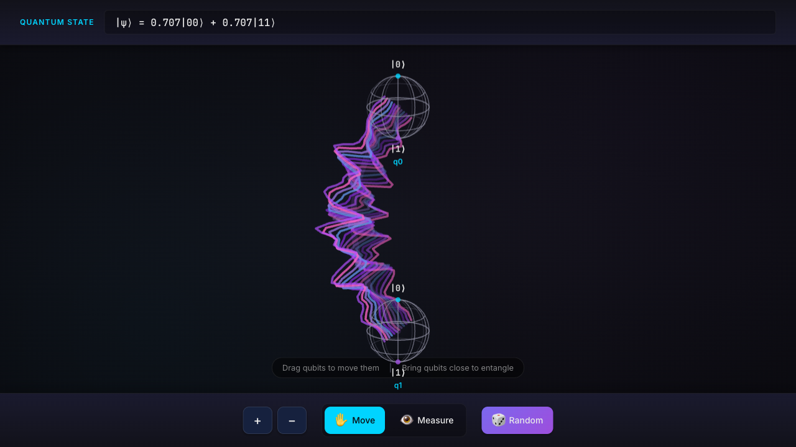
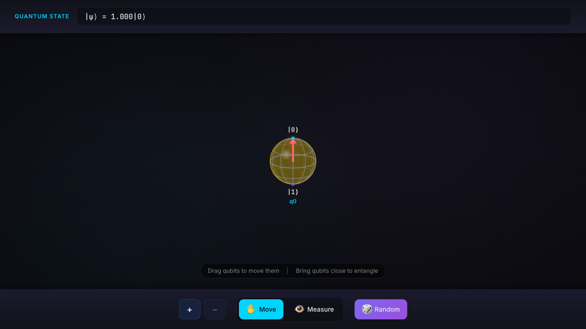
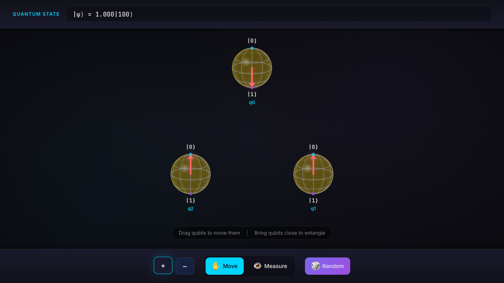
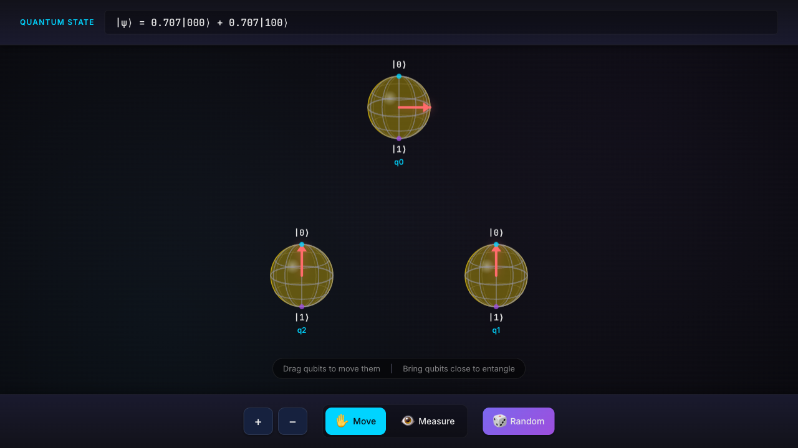
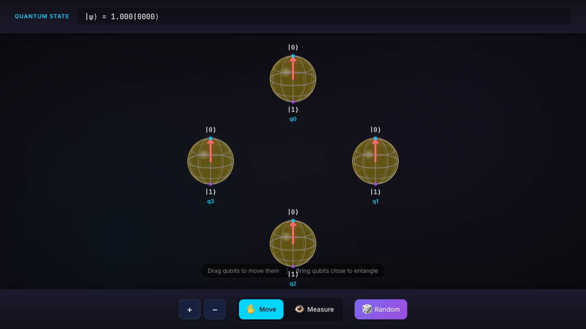
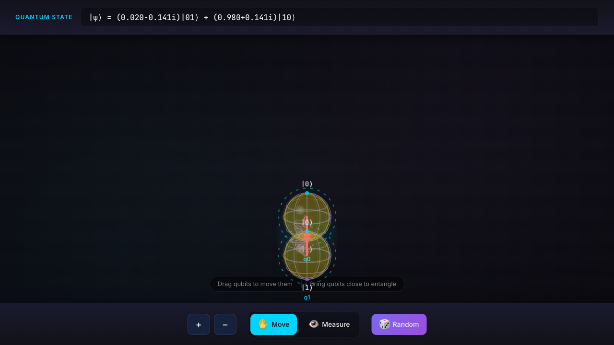
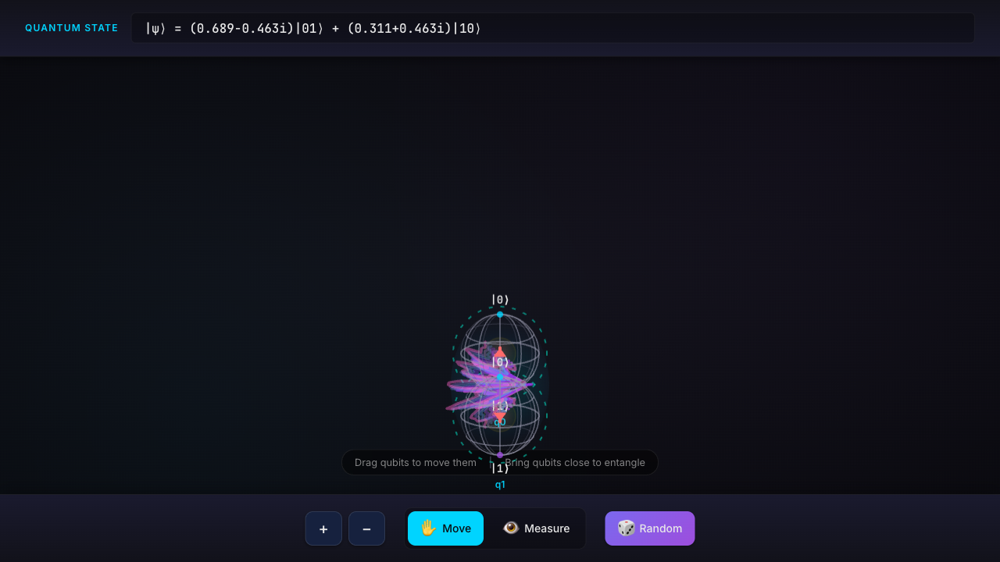

# MEQANIC - Interactive Quantum State Visualizer

MEQANIC is an interactive web-based quantum computing visualization tool that provides intuitive, physics-accurate representations of quantum states using Bloch spheres and entanglement visualizations.



## Table of Contents

- [Philosophy](#philosophy)
- [Single Qubit Physics](#single-qubit-physics)
  - [The Bloch Sphere](#the-bloch-sphere)
  - [State Vector Representation](#state-vector-representation)
  - [Visualization Elements](#visualization-elements)
- [Multi-Qubit Systems](#multi-qubit-systems)
  - [Tensor Product States](#tensor-product-states)
  - [Reduced Density Matrices](#reduced-density-matrices)
- [Entanglement](#entanglement)
  - [What is Entanglement?](#what-is-entanglement)
  - [How Entanglement is Created](#how-entanglement-is-created)
  - [Measuring Entanglement: Concurrence](#measuring-entanglement-concurrence)
  - [Visualization of Entanglement](#visualization-of-entanglement)
- [Heisenberg Exchange Interaction](#heisenberg-exchange-interaction)
- [Measurement](#measurement)
- [Getting Started](#getting-started)

---

## Philosophy

MEQANIC is built on a core principle: **physics accuracy first, visualization second**. Every visual element directly corresponds to a real quantum mechanical quantity:

1. **Single Source of Truth**: The quantum state vector |ψ⟩ with 2^N complex amplitudes is the authoritative representation. All visualizations are derived from it.

2. **Bloch Sphere as Window**: Each qubit's Bloch sphere shows the *reduced* state of that qubit after tracing out all others. This reveals how entanglement manifests as mixed states.

3. **Purity = Knowledge**: The size of the inner golden sphere represents how much we "know" about that qubit in isolation. Pure states fill the sphere; entangled qubits appear mixed.

4. **Entanglement as Correlation**: The colorful oscillating arcs between qubits represent quantum correlations that cannot be explained classically—the defining feature of entanglement.

---

## Single Qubit Physics

### The Bloch Sphere

A single qubit exists in a 2-dimensional complex Hilbert space. Any pure state can be written as:

```
|ψ⟩ = cos(θ/2)|0⟩ + e^(iφ)sin(θ/2)|1⟩
```

This maps to a point on the **Bloch sphere**:
- **North pole (|0⟩)**: θ = 0
- **South pole (|1⟩)**: θ = π
- **Equator**: Equal superpositions like |+⟩ = (|0⟩ + |1⟩)/√2


*A qubit in the |0⟩ state. The red arrow points straight up to the north pole. The full-size golden sphere indicates maximum purity (pure state).*


*A qubit in the |1⟩ state. The red arrow points straight down to the south pole.*


*A qubit in the |+⟩ = (|0⟩ + |1⟩)/√2 superposition. The red arrow points along the +X axis on the equator.*

### State Vector Representation

The quantum state is stored as an array of 2^N complex amplitudes:

```javascript
// For N qubits, the state vector has 2^N entries
|ψ⟩ = α₀|00...0⟩ + α₁|00...1⟩ + ... + α_{2^N-1}|11...1⟩

// Each amplitude αᵢ is a complex number
αᵢ = { re: real_part, im: imaginary_part }

// Normalization constraint: Σ|αᵢ|² = 1
```

### Visualization Elements

| Element | Quantum Meaning |
|---------|-----------------|
| **Wireframe sphere** | The space of all possible single-qubit pure states |
| **Red arrow** | The Bloch vector (x, y, z) extracted from the reduced density matrix |
| **Golden inner sphere** | Purity Tr(ρ²) — size indicates how "pure" the single-qubit state is |
| **|0⟩ / |1⟩ labels** | Computational basis states at the poles |

#### Extracting the Bloch Vector

From a 2×2 reduced density matrix ρ:

```
x = 2·Re(ρ₀₁)     // Coherence, real part
y = -2·Im(ρ₀₁)    // Coherence, imaginary part
z = ρ₀₀ - ρ₁₁     // Population difference
```

The Bloch vector magnitude equals 1 for pure states and < 1 for mixed states.

---

## Multi-Qubit Systems

### Tensor Product States

When qubits are independent (not entangled), the total state is a tensor product:

```
|ψ_total⟩ = |ψ_A⟩ ⊗ |ψ_B⟩

Example: |0⟩ ⊗ |0⟩ = |00⟩
```


*Two qubits in the product state |00⟩. Both arrows point up, both have full purity, and there are no entanglement lines.*

### Reduced Density Matrices

To visualize a single qubit within a multi-qubit system, we compute its **reduced density matrix** by performing a **partial trace** over all other qubits:

```
ρ_A = Tr_B(|ψ⟩⟨ψ|)
```

**Algorithm** (for qubit k in an N-qubit system):

```javascript
function partialTrace(stateVector, qubitIndex, numQubits) {
    const reducedDM = [[0, 0], [0, 0]];  // 2×2 matrix

    for (let i = 0; i < 2^N; i++) {
        for (let j = 0; j < 2^N; j++) {
            // Extract bit at qubitIndex
            const bit_i = (i >> (N - 1 - qubitIndex)) & 1;
            const bit_j = (j >> (N - 1 - qubitIndex)) & 1;

            // Mask for all OTHER qubits
            const mask = ~(1 << (N - 1 - qubitIndex));

            // Only contribute if other qubits match
            if ((i & mask) === (j & mask)) {
                reducedDM[bit_i][bit_j] += ψ[i] * conj(ψ[j]);
            }
        }
    }
    return reducedDM;
}
```

---

## Entanglement

### What is Entanglement?

Entanglement occurs when a multi-qubit state **cannot** be written as a tensor product of individual qubit states. The simplest example is the **Bell state**:

```
|Φ⁺⟩ = (|00⟩ + |11⟩) / √2
```

This state has remarkable properties:
- Neither qubit has a definite value on its own
- Measuring one instantly determines the other
- The correlations exceed any classical explanation

### How Entanglement is Created

In MEQANIC, entanglement is created through **Heisenberg exchange interaction**. When two qubits are brought close together, they interact via:

```
H = (J/4) · σ⃗_A · σ⃗_B
```

where J is the coupling strength (depends on distance) and σ⃗ are the Pauli matrices.


*Two qubits undergoing Heisenberg exchange. The cyan dashed circles indicate the interaction zone. The state notation shows the superposition forming: |ψ⟩ = α|01⟩ + β|10⟩*

**Key insight**: The exchange interaction mixes the |01⟩ and |10⟩ states (anti-aligned spins), creating entanglement. Aligned spins (|00⟩, |11⟩) are unaffected.

### Measuring Entanglement: Concurrence

MEQANIC uses **concurrence** to quantify entanglement between qubit pairs. For a two-qubit pure state:

```
C = 2|αδ - βγ|

where |ψ⟩ = α|00⟩ + β|01⟩ + γ|10⟩ + δ|11⟩
```

- C = 0: No entanglement (product state)
- C = 1: Maximum entanglement (Bell state)

For the Bell state (|00⟩ + |11⟩)/√2:
- α = 1/√2, β = 0, γ = 0, δ = 1/√2
- C = 2|(1/√2)(1/√2) - 0| = 1 ✓

For mixed states (when qubits are part of a larger system), we use the **linear entropy method**:

```
C ≈ √(2(1 - Tr(ρ_A²)))
```

where ρ_A is the single-qubit reduced density matrix.

### Visualization of Entanglement

Entanglement is visualized as **oscillating colorful arcs** between qubit pairs:


*The Bell state |Φ⁺⟩ = (|00⟩ + |11⟩)/√2. Notice:*
- *Colorful oscillating arcs connecting the qubits*
- *Small inner spheres (purity ≈ 0.5, maximally mixed)*
- *No visible Bloch vectors (mixed state has zero-length Bloch vector)*

| Visual Property | Quantum Meaning |
|-----------------|-----------------|
| Arc presence | Concurrence > threshold (qubits are entangled) |
| Arc intensity/opacity | Proportional to concurrence |
| Number of wavy lines | More lines = stronger entanglement |
| Wave amplitude | Higher entropy = more chaotic oscillations |
| Colors (pink/purple/blue) | Aesthetic inspired by [Quantum Intuition XR](https://arxiv.org/abs/2504.08984) |

---

## Heisenberg Exchange Interaction

The Heisenberg exchange is the fundamental interaction that creates entanglement between nearby spins:

### Physics

```
H_exchange = (J/4) · (σ_x⊗σ_x + σ_y⊗σ_y + σ_z⊗σ_z)
```

The time evolution operator for two spins is:

```
U(t) = exp(-iHt)
```

This creates the following transformation:
- |00⟩ → |00⟩ (unchanged)
- |11⟩ → |11⟩ (unchanged)
- |01⟩ → cos(Jt/2)|01⟩ - i·sin(Jt/2)|10⟩
- |10⟩ → cos(Jt/2)|10⟩ - i·sin(Jt/2)|01⟩

### Distance Dependence

The coupling strength J decreases with distance:

```javascript
J(distance) = (J_max/2) · (1 + tanh((threshold/2 - distance) / 30))
```

This creates a smooth transition from strong coupling when close to no coupling when far apart.

### Creating Entanglement

1. Start with anti-aligned qubits: |01⟩
2. Bring them close together
3. Exchange mixes |01⟩ ↔ |10⟩, creating superposition
4. Separate them—entanglement persists!


*After Heisenberg exchange, the qubits remain entangled even when separated. The entanglement lines persist, showing the quantum correlation.*

---

## Measurement

Measurement in quantum mechanics is probabilistic and causes **state collapse**.

### Process

1. **Calculate probabilities**: P(0) = Σ|α_i|² for all states with measured qubit = 0
2. **Random outcome**: Choose 0 or 1 based on probabilities
3. **Collapse**: Zero out amplitudes inconsistent with outcome
4. **Renormalize**: Scale remaining amplitudes so Σ|α_i|² = 1

### Effect on Entanglement

**Measurement destroys entanglement** with the measured qubit:

| Before Measurement | After Measurement |
|--------------------|-------------------|
| Bell state: (|00⟩+|11⟩)/√2 | Either |00⟩ or |11⟩ |
| Purity: 0.5 (mixed) | Purity: 1.0 (pure) |
| Entangled | Not entangled |

This is correct quantum behavior—the correlations that defined the entanglement are "used up" in determining the measurement outcome.

---

## Getting Started

### Running Locally

1. Clone the repository
2. Start a local server:
   ```bash
   python3 -m http.server 8080
   ```
3. Open http://localhost:8080 in your browser

### Controls

| Control | Action |
|---------|--------|
| **+ / -** | Add or remove qubits |
| **Move** | Drag qubits to reposition them |
| **Measure** | Click a qubit to measure it |
| **Random** | Generate a random quantum state |

### Creating Entanglement

1. Add at least 2 qubits
2. In Move mode, drag one qubit close to another
3. Watch the exchange interaction create entanglement
4. Separate them—the entanglement persists!

---

## Technical Stack

- **Vanilla JavaScript** with ES6 modules
- **HTML5 Canvas** for rendering
- **math.js** for complex number operations
- No build system required—runs directly in browser

## Acknowledgments

The entanglement visualization style in MEQANIC—featuring colorful oscillating arcs that become more chaotic with higher entanglement entropy—is directly inspired by the **Quantum Intuition XR** project:

> **Quantum Intuition XR: Embodied Learning of Quantum Entanglement and Measurement with an XR Serious Game**
>
> Samantha Norris, Charles Tahan, et al.
>
> arXiv:2504.08984 (2025)
>
> https://arxiv.org/abs/2504.08984

The paper presents an immersive XR experience for teaching quantum mechanics concepts. Figure 5 in the paper shows the entanglement visualization that inspired MEQANIC's oscillating arc design, where:
- Multiple wavy lines connect entangled qubits
- Line intensity and chaos increase with entanglement entropy S₂(ρ)
- The visual language makes the abstract concept of entanglement tangible

## References

- **Quantum Intuition XR** - Norris, Tahan, et al. [arXiv:2504.08984](https://arxiv.org/abs/2504.08984) (2025) - Primary inspiration for entanglement visualization
- Nielsen & Chuang, *Quantum Computation and Quantum Information* - Theoretical foundations
- Wootters, W. K. "Entanglement of Formation of an Arbitrary State of Two Qubits" - Concurrence formula

---

## License

MIT License - See LICENSE file for details.
